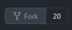

# Developer Documentation

## Contributing
Please read the [contributing guidelines here](https://github.com/graycoreio/daffodil/blob/develop/CONTRIBUTING.md).

## Building the Project
### Prerequisites
* [Angular CLI](https://cli.angular.io/)
* [Lerna](https://github.com/lerna/lerna)
* [Node](https://nodejs.org)
* [Git](https://git-scm.com/)

### Installing Global Dependencies
```bash
npm install -g lerna @angular/cli
```

## Creating Your Own Fork
[Fork the Daffodil Repository](https://github.com/graycoreio/daffodil/fork)



Clone your repository
```bash
git clone git@github.com:{username}/daffodil.git && cd daffodil
git checkout -b new-branch
```

### Installing Dependencies
```bash
npm install
```

### Full Build
You can run a full build that builds all projects and libraries via:

```bash
lerna run build
```

### Partial Build
If you want to build a single project or library, you can run:

```bash
lerna run build --scope="@daffodil/{library}"
lerna run build --scope="@daffodil/{app}"
```

For example,

```bash
lerna run build --scope="@daffodil/core"
```

## Running unit tests
Much like builds, we utilize Lerna and the Angular CLI to run our tests.

### Full Test Suite
To run the full suite

```
lerna run test
```

### Partial Test Suite
If you want to run a single project or library's test suite
```
ng test libName
ng test appName
```

## Reference
You can read more about each library and it's build/testing process in the readme of the relevant library or app.

### Apps
* [daff.io](../apps/daffio/README.md)
* [demo](../apps/daffio/README.md)
* [design-land](../apps/design-land/README.md)

### Libraries
* [core](../libs/core/README.md)
* [checkout](../libs/checkout/README.md)
* [cart](../libs/cart/README.md)
* [drivers](../libs/drivers/README.md)
* [design](../libs/design/README.md)
* [product](../libs/product/README.md)