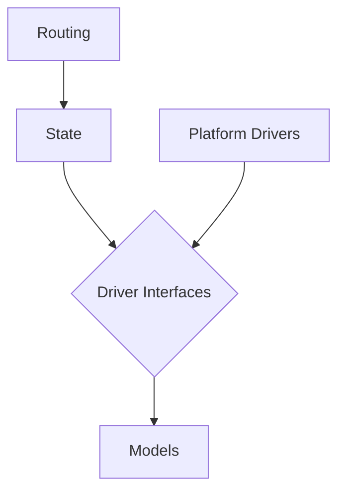

# About Daffodil

Daffodil is a client-side framework for building ecommerce stores. It presents a standard set of interfaces with which the frontend application can interact along with a selection of drivers that communicate with the platform of choice.

## Objectives
Daffodil aims to:
- Provide a strongly-typed set of libraries and component kit to simplify ecommerce store development
- Ease migration between ecommerce platforms by decoupling frontend code from the current platform's API
- Provide a collection of features a-la carte style such that no unused features are unnecessarily imported
- Allow extension and customization such that business-specific features can be supported in a platform-agnostic way

<!--- TODO: add link to longer motivations explanation --->

## Architecture
The most common type of Daffodil package has a number of layers that can be visualized like so:

Each of these layers exists as a subpackage of the corresponding feature module, e.g. `@daffodil/cart/state`.
<!--- TODO: add link to longer architecture explanation --->
